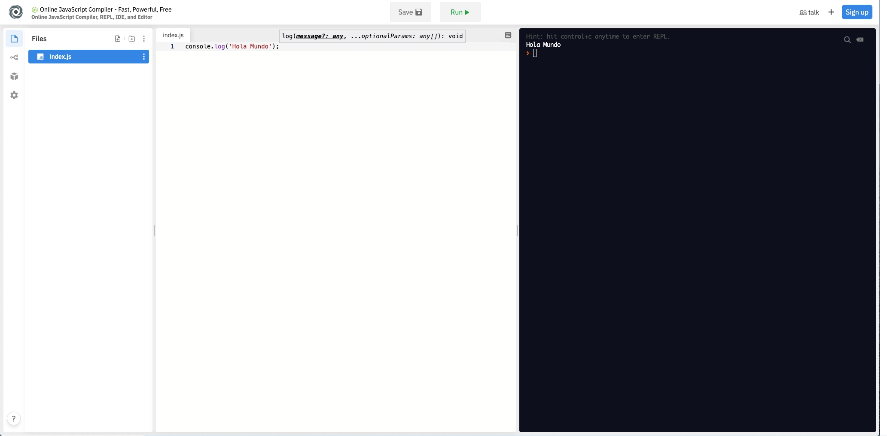

# Introducción a Javascript (ECMAScript)

> Gran parte de este material está extraído de la web [https://developer.mozilla.org/es/docs](https://developer.mozilla.org/es/docs)

## ¿Qué es Javascript?

JavaScript es un lenguaje de programación multiplataforma orientado a objetos que se utiliza para hacer que las páginas web sean interactivas (p. ej., Que tienen animaciones complejas, botones en los que se puede hacer clic, menús emergentes, etc.). **También hay versiones de JavaScript de lado del servidor más avanzadas, como Node.js, que te permiten agregar más funcionalidad a un sitio web** que simplemente descargar archivos (como la colaboración en tiempo real entre varias computadoras). Dentro de un entorno (por ejemplo, un navegador web), JavaScript se puede conectar a los objetos de su entorno para proporcionar control programático sobre ellos.

JavaScript contiene una biblioteca estándar de objetos, como Array, Date y Math, y un conjunto básico de elementos del lenguaje como operadores, estructuras de control y declaraciones. El núcleo de JavaScript se puede extender para una variedad de propósitos completándolo con objetos adicionales; por ejemplo:

JavaScript de lado del servidor amplía el núcleo del lenguaje al proporcionar objetos relevantes para ejecutar JavaScript en un servidor. Por ejemplo, las extensiones de lado del servidor permiten que una aplicación se comunique con una base de datos, brinde continuidad de información de una invocación a otra de la aplicación o realice manipulación de archivos en un servidor.

Esto significa que en el navegador, JavaScript puede cambiar la apariencia de la página web (DOM). Y, del mismo modo, el JavaScript de Node.js en el servidor puede responder a solicitudes personalizadas desde el código escrito en el navegador.

## Javascript no es Java

| Javascript | Java
|------------|------
| Orientado a objetos. No hay distinción entre tipos de objetos. La herencia se realiza a través del mecanismo de prototipo, y las propiedades y métodos se pueden agregar a cualquier objeto de forma dinámica. | Basado en clases. Los objetos se dividen en clases e instancias con toda la herencia a través de la jerarquía de clases. Las clases y las instancias no pueden tener propiedades o métodos agregados dinámicamente.
| Los tipos de datos de las variables no se declaran (tipado dinámico, tipado flexible). | Los tipos de datos de las variables se deben declarar (tipado estático, fuertemente tipado).

## Javascript y la especificación ECMAScript 

JavaScript está estandarizado en Ecma International, la asociación europea para estandarizar los sistemas de información y comunicación (ECMA antes era un acrónimo para la Asociación Europea de Fabricantes de Computadoras) para ofrecer un lenguaje de programación internacional estandarizado basado en JavaScript. Esta versión estandarizada de JavaScript, denominada ECMAScript, se comporta de la misma manera en todas las aplicaciones que admiten el estándar. Las empresas pueden utilizar el lenguaje estándar abierto para desarrollar su implementación de JavaScript. El estándar ECMAScript está documentado en la especificación ECMA-262. Consulta Novedades en JavaScript para obtener más información sobre las diferentes versiones de JavaScript y las ediciones de especificación ECMAScript.

El estándar ECMA-262 también está aprobado por ISO (Organización Internacional de Normalización) como ISO-16262. También puedes encontrar la especificación en el sitio web de Ecma International. 

## Cómo empezar con Javascript

En muchos lugares leerás que lo único que necesitas es un navegador moderno. Esto está bien si te vas a orientar a _frontend_. En el caso de que lo vayas a hacer con backend, sería bueno tener instalado Node.js (hablaremos de él más adelante).

Mientras hacemos la instalación del mismo, podemos empezar trabajando con algún entorno online, como [https://repl.it/languages/javascript](https://repl.it/languages/javascript).

Si queremos implementar nuestro primer programa "Hola Mundo", tan solo necesitamos escribir el siguiente código en la pestaña con nombre `index.js` (o similar):

```javascript
console.log("Hola Mundo");
```

y pulsar el botón Run.



